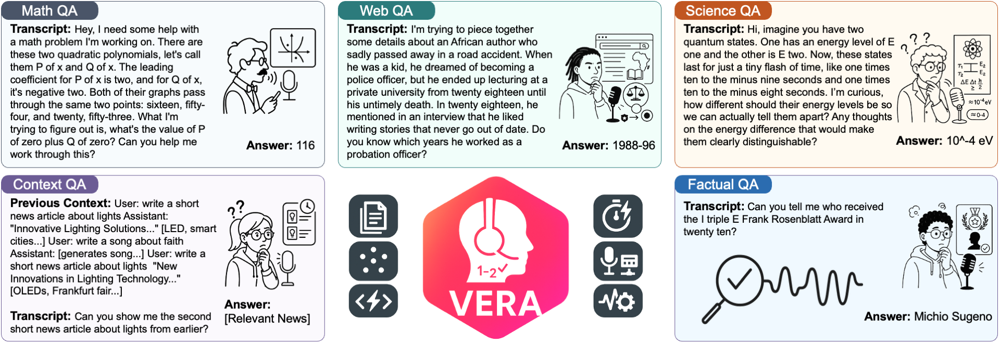

# VERA: Voice Evaluation of Reasoning Ability

[](https://opensource.org/licenses/MIT) [](https://arxiv.org/abs/2509.26542)

**Voice Evaluation of Reasoning Ability: Diagnosing the Modality-Induced Performance Gap**



We present Voice Evaluation of Reasoning Ability (VERA), a benchmark for evaluating reasoning ability in voice-interactive systems under real-time conversational constraints. VERA comprises 2,931 voice-native episodes derived from established text benchmarks and organized into five tracks (Math, Web, Science, Long-Context, Factual). Each item is adapted for speech interaction while preserving reasoning difficulty.

## Installation

```bash
# Clone the repository
git clone https://github.com/linyueqian/VERA.git
cd VERA

# Install uv if you haven't already
curl -LsSf https://astral.sh/uv/install.sh | sh

# Install dependencies (handles virtual environment automatically)
uv sync
```

## Dataset

The VERA dataset contains 2,931 voice-native episodes across five tracks. Questions and answers are encrypted using XOR cipher to prevent memorization. See [data/README.md](data/README.md) for complete details on structure, encryption, and decryption.

### Download

Download the complete dataset from Google Drive: https://drive.google.com/file/d/1k0b4qXfQ16fVqe-hMn_GSsfc0exCLgSq/view?usp=sharing

### Sample Data

Check `test_voice_episodes/` for unencrypted examples:

```bash
# View sample episode structure
cat test_voice_episodes/test.json

# Listen to sample audio
ls test_voice_episodes/audio/
```

## Quick Start

### 1. Set up API keys

```bash
cp .env.template .env
# Edit .env with your API keys
```

### 2. Run evaluation

```bash
# Evaluate voice models
uv run python evaluation/voice/batch_evaluate.py

# Evaluate text models (for comparison)
uv run python evaluation/text/batch_evaluate.py

# Evaluate realtime models
uv run python evaluation/realtime/batch_evaluate.py
```

### 3. View results

Results will be saved in the specified output directory with performance metrics and analysis.

## Acknowledgements

We thank the [Full-Duplex-Bench](https://github.com/DanielLin94144/Full-Duplex-Bench) project for their implementations of several realtime models, including Freeze-Omni, Moshi, and Sonic, which we adapted for use in VERA.

## Citation

If you use VERA in your research, please cite our paper:

```bibtex
@misc{lin2025vera,
  title={Voice Evaluation of Reasoning Ability: Diagnosing the Modality-Induced Performance Gap},
  author={Lin, Yueqian and Hu, Zhengmian and Wang, Qinsi and Liu, Yudong and Zhang, Hengfan and Subramanian, Jayakumar and Vlassis, Nikos and Li, Hai Helen and Chen, Yiran},
  year={2025},
  eprint={2509.26542},
  archivePrefix={arXiv},
  primaryClass={eess.AS},
  url={https://arxiv.org/abs/2509.26542}
}
```

## License

This project uses a dual licensing structure:

- **Code**: MIT License (see [LICENSE](LICENSE))
- **Data**: The text data follows upstream licenses (MIT for SimpleQA, BrowseComp, MRCR; CC BY 4.0 for GPQA-Diamond). The audio data is generated with Boson Higgs Audio 2 and is subject to the Boson Higgs Audio 2 Community License.

For complete licensing details, attribution information, and restrictions, please see:
- [ATTRIBUTIONS.md](ATTRIBUTIONS.md) for data source attributions
- [NOTICE.txt](NOTICE.txt) for audio generation licensing and restrictions
- [LICENSES/](LICENSES/) for full license texts
